# Sistema de Controle de Chamados de Manutenção

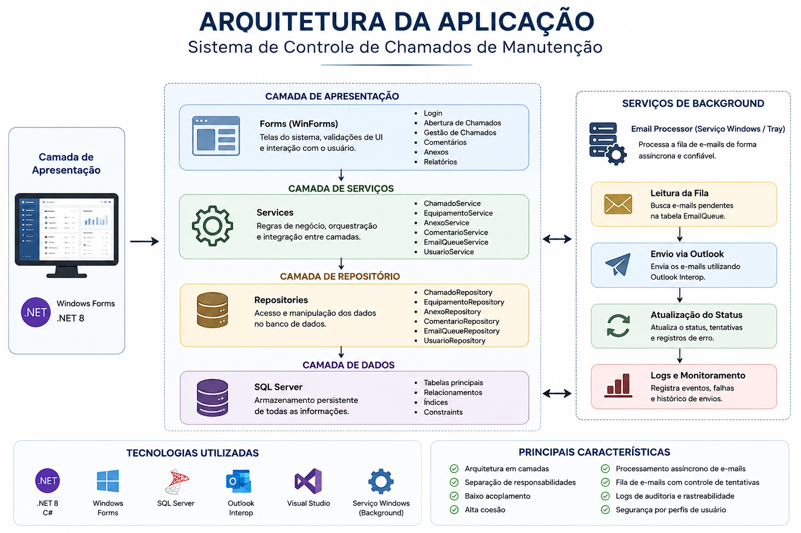

Sistema desktop desenvolvido em C# (.NET 8) para gerenciamento de chamados de manutenção em ambiente industrial farmacêutico.

---

## Sobre o Projeto

O Sistema de Controle de Chamados de Manutenção foi desenvolvido como um projeto pessoal de aprendizado e aplicação prática em uma empresa, a fim de centralizar o gerenciamento de ocorrências relacionadas a equipamentos laboratoriais e industriais. Essa ferramente permite o acompanhamento completo do ciclo de vida de um chamado pela equipe de manutenção e gestão, desde sua abertura até sua conclusão.

O projeto foi construído utilizando arquitetura em camadas, SQL Server para persistência dos dados e um serviço independente para processamento assíncrono de notificações por e-mail (EmailProcessor).

---

## Principais Funcionalidades

### Gestão de Chamados

* Abertura de chamados
* Atendimento de chamados
* Finalização de chamados
* Reabertura de chamados
* Exclusão/Inativação
* Controle de status

### Gestão de Comentários

* Histórico completo de interações
* Registro de usuário e data
* Controle por perfil de acesso
* Bloqueio de inclusão após finalização para usuários comuns

### Gestão de Anexos

* Upload de documentos
* Download de anexos
* Exclusão controlada por perfil
* Armazenamento externo ao banco de dados

### Gestão de Equipamentos

* Cadastro de equipamentos
* Controle de sistemas ativos/inativos

### Notificações por E-mail

* Geração automática de notificações por e-mail
* Processamento assíncrono
* Controle de tentativas
* Registro de falhas
* Rastreabilidade completa

---

## Tecnologias Utilizadas

| Tecnologia               | Utilização                 |
| ------------------------ | -------------------------- |
| .NET 8                   | Aplicação principal        |
| Windows Forms            | Interface gráfica          |
| SQL Server               | Banco de dados             |
| Outlook Interop          | Envio de e-mails           |
| Windows Tray Application | Serviço de processamento   |
| Git                      | Controle de versão         |
| GitHub                   | Hospedagem da documentação |

---

## Arquitetura

A aplicação utiliza arquitetura em camadas:

* Camada de Apresentação (WinForms)
* Camada de Serviços
* Camada de Repositórios
* Camada de Dados (SQL Server)

Além disso, possui um serviço independente responsável pelo processamento da fila de e-mails.

Documentação detalhada:

* docs/arquitetura.md
* docs/banco-dados.md
* docs/fluxo-email.md

---

# Capturas de Tela

## Tela de Login

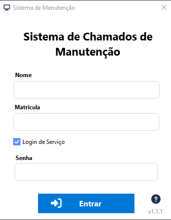

---

## Painel Principal (User)

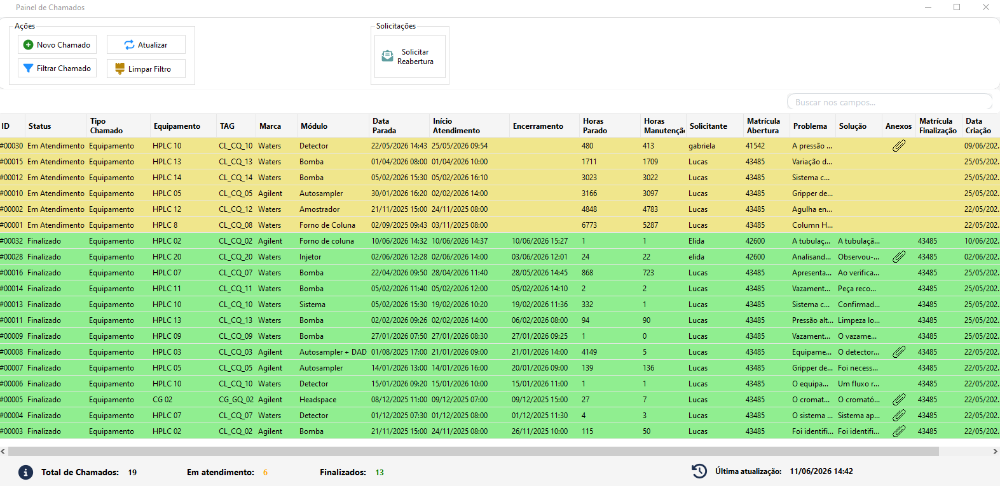

---

## Painel Principal (Técnico)

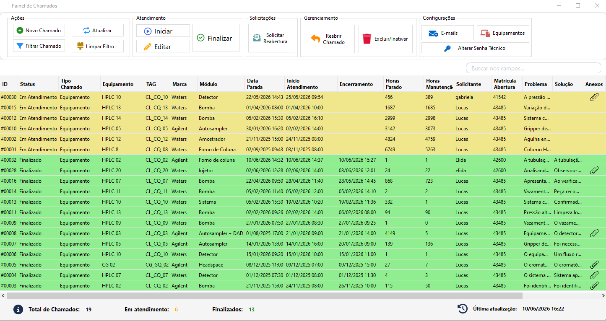

---

## Abertura de Chamado

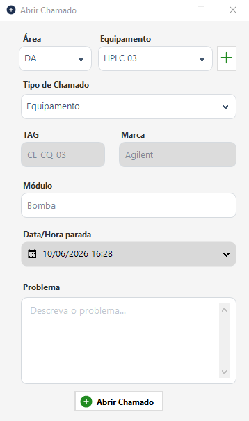

---

## Detalhamento de Chamado
Painel do User
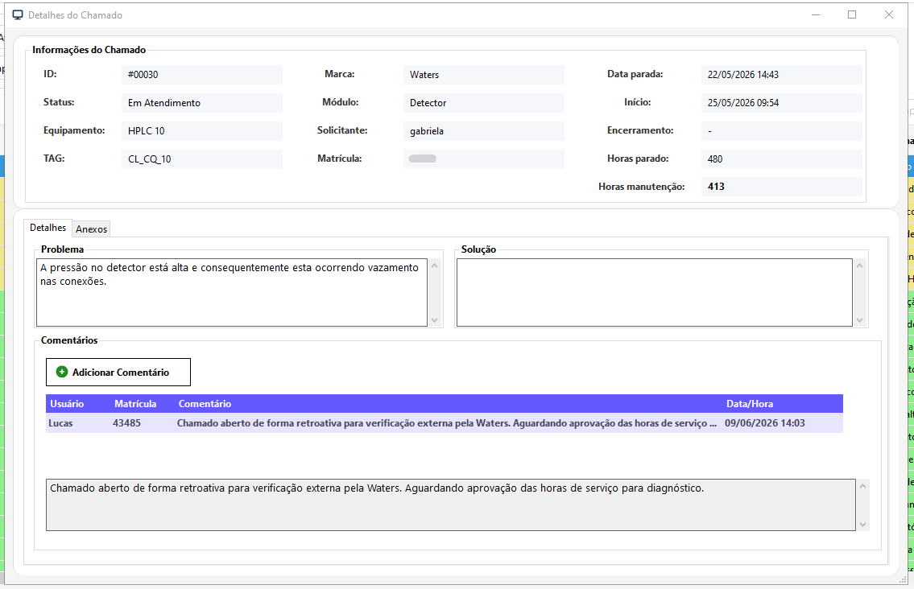
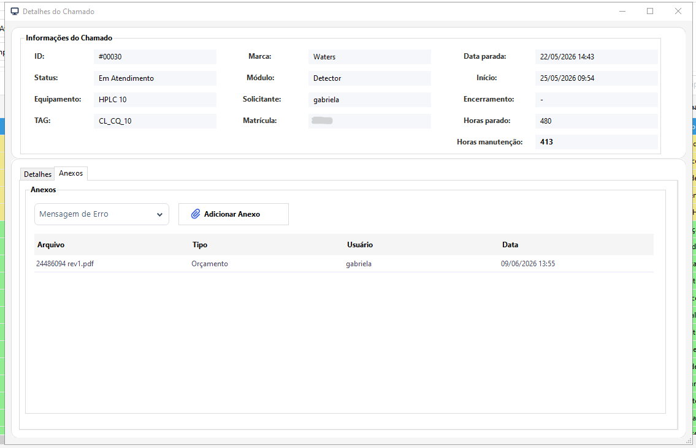

Painel de Técnico
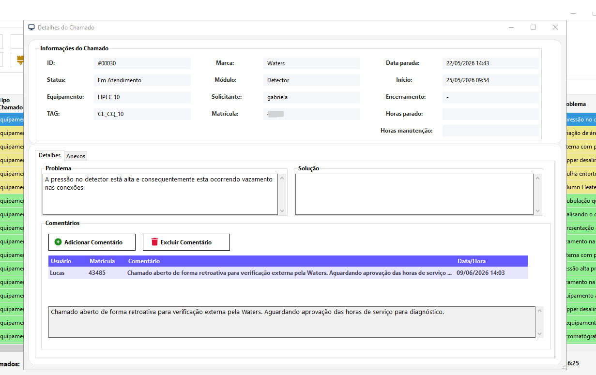
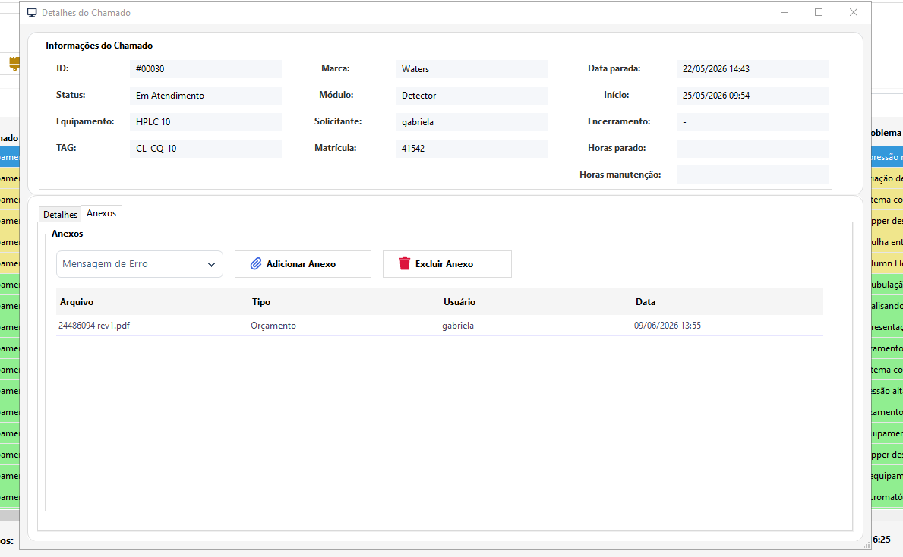

Menu Combobox

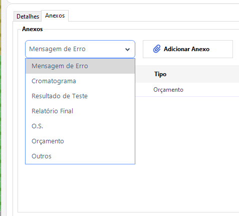

---

## Filtro de Chamado

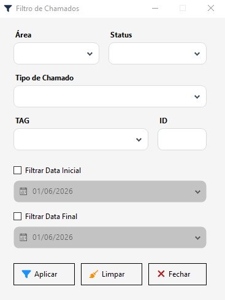

---

## Configuração de Equipamentos

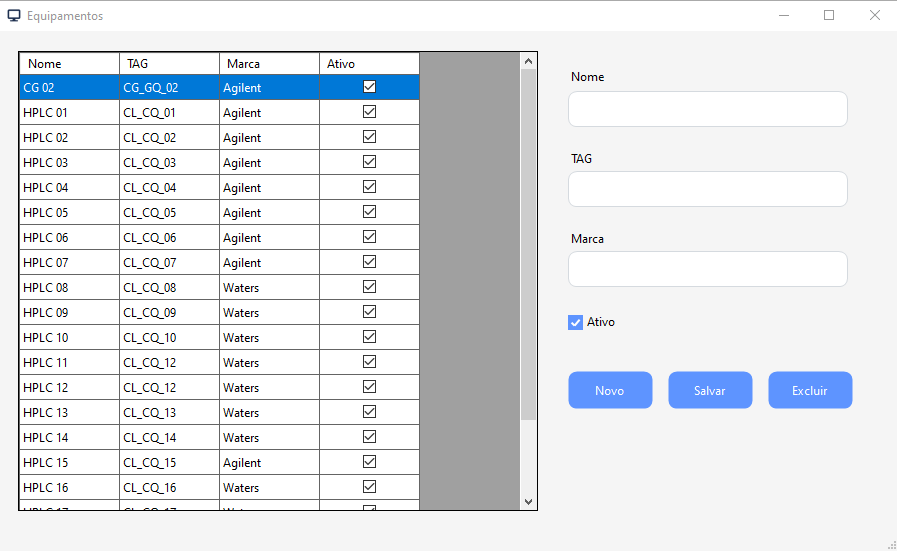
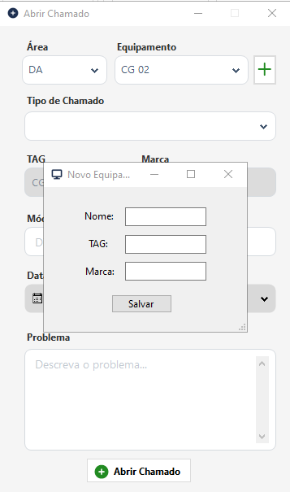

---

## Estrutura do Banco de Dados

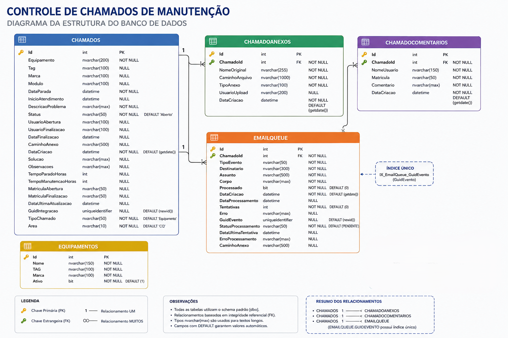

---

## Fluxo de Processamento de E-mails

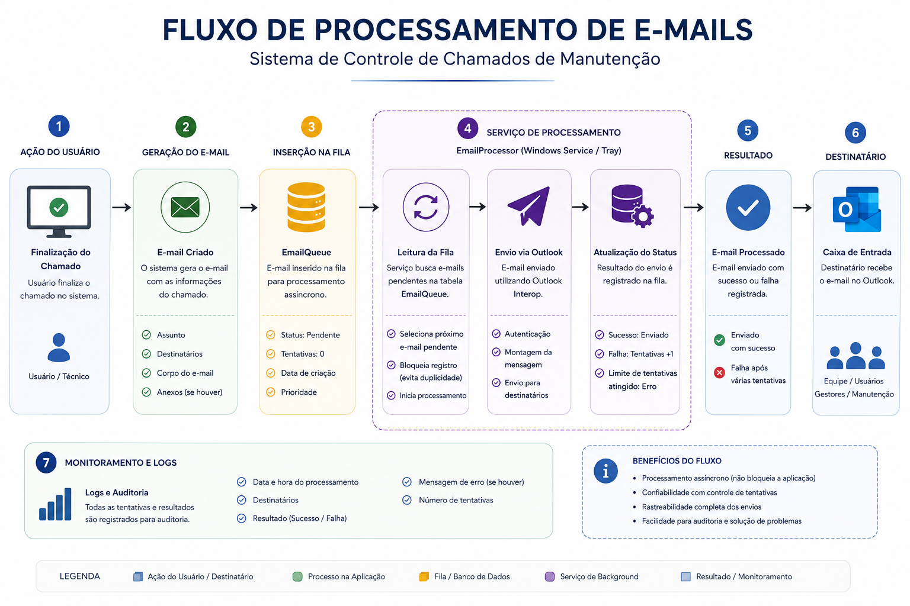

---

## Funcionalidades Implementadas

### Controle de Chamados

* Abertura
* Atendimento
* Encerramento
* Reabertura
* Inativação

### Controle de Comentários

* Registro histórico
* Controle por perfil (User | Técnico)
* Bloqueio em chamados finalizados

### Controle de Anexos

* Upload
* Download
* Exclusão controlada (Técnico)

### Processamento de E-mails

* Fila assíncrona
* Controle de tentativas
* Registro de falhas
* Integração com Outlook

---

## Status do Projeto

Versão atual:

**v1.1.1**

---

## Próximas alterações importantes

* Consulta de Logs dentro do aplicação
* Alteração de tipo de usuário dentro da aplicação
* CRUD de usuários com autenticação JWT (ASP.NET Core)

---

## Código-Fonte

Este repositório possui finalidade exclusivamente documental.

O código-fonte completo encontra-se em repositório privado. O mesmo poderá ser disponibilizado para recrutadores, gestores técnicos ou avaliadores, mediante solicitação.

---

## Autor

Lucas Albuquerque
